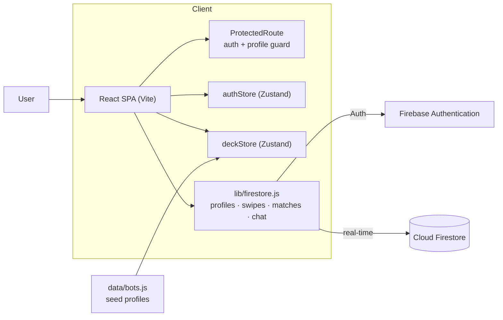
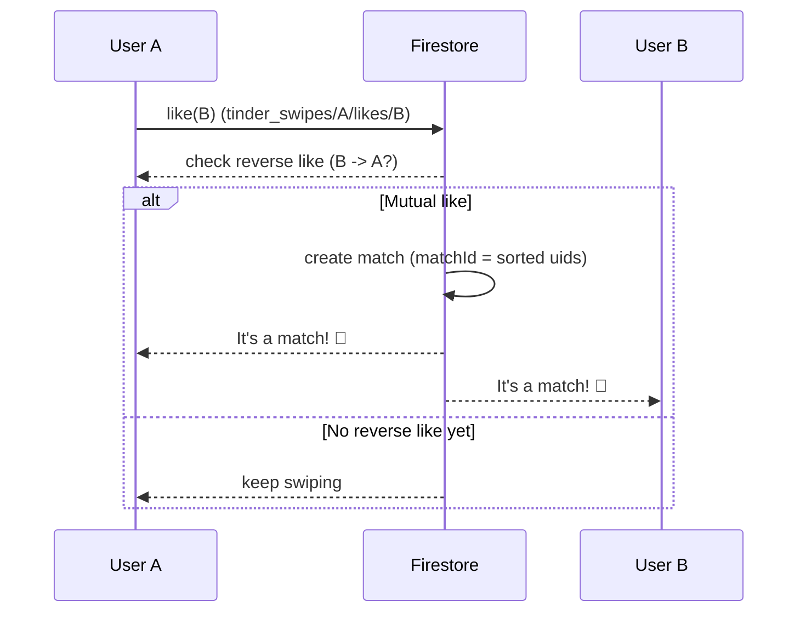

<div align="center">

# Spark — Dating App

**A full-stack dating web app** with real swipe-to-match, mutual matching, and live chat — built with React 18 and Firebase.

[](https://react.dev/)
[](https://vitejs.dev/)
[](https://tailwindcss.com/)
[](https://firebase.google.com/)
[](https://www.framer.com/motion/)
[](LICENSE)

**[🌐 Live Demo](https://spark.giovanni-moreno.com)** · Built by [Giovanni Moreno](https://giovanni-moreno.com)

</div>

---

## Overview

**Spark** is a fully functional dating app — not a static demo. Registration, swipes, matches, and chat are persisted in the cloud (Cloud Firestore), and real users appear in each other's discovery deck. It's built with **React 18**, **Vite**, **Tailwind CSS**, **Zustand**, **Framer Motion**, and **Firebase** (Authentication + Firestore).

To keep the experience lively while the user base grows, Spark seeds a few **bot profiles** that match instantly and reply in chat.

> ⚠️ This is an independent portfolio project inspired by swipe-based dating apps. It is **not affiliated with, endorsed by, or connected to** Tinder or Match Group.

> Keywords: React, Firebase, Firestore, dating app, swipe, real-time chat, Zustand, Framer Motion, Tailwind CSS, full-stack web app.

## ✨ Features

| | Feature |
|---|---|
| 🔐 | **Authentication** — email/password and Google sign-in (with popup → redirect fallback for mobile) |
| 📝 | **Onboarding** — create your profile (name, age, job, bio, photo) |
| 🃏 | **Swipe deck** — drag-to-swipe cards with LIKE / NOPE stamps and tap-to-cycle photos |
| 💞 | **Real mutual matching** — a match happens only when two users like each other |
| 🤖 | **Seed bots** — always-available profiles that match instantly and reply in chat |
| 💬 | **Real-time chat** — live messages via Firestore `onSnapshot` with last-message preview |
| 📋 | **Matches list** — sorted by most recent activity |
| 👤 | **Profile** — view your own profile and log out |

## 🧱 Tech Stack

**Frontend:** React 18 · Vite · React Router 6 · Tailwind CSS · Zustand · Framer Motion · lucide-react

**Backend (Firebase):** Firebase Authentication · Cloud Firestore (real-time) · Firebase Hosting

## 🏗️ Architecture



### Matching Flow



### Data Model (Firestore)

```
tinder_profiles/{uid}                          -> public profile (readable by authenticated users)
tinder_swipes/{uid}/likes/{targetUid}          -> likes/nopes (private per user)
tinder_matches/{matchId}                       -> a match between two users (matchId = sorted uids)
tinder_matches/{matchId}/messages/{msgId}      -> chat messages
```

Security rules restrict each document to its owner or to the participants of the match. They live in a central `firebase-firestore-rules` repository (the Firestore base is shared across portfolio projects with a single ruleset), not in this repo.

## 📂 Project Structure

```
src/
  lib/         firebase.js (init) and firestore.js (profiles, swipes, matches, chat)
  store/       authStore.js, deckStore.js
  data/        bots.js (seed profiles and replies)
  components/  SwipeCard, ActionButtons, MatchModal, ChatBubble, TopNav, ...
  pages/       Login, Onboarding, Discover, Matches, Chat, Profile
```

## 🚀 Getting Started

### Prerequisites
- Node.js 18+ and npm
- A Firebase project with Authentication (Email/Password + Google) and Cloud Firestore enabled

### Installation

1. Clone the repository:
   ```bash
   git clone https://github.com/Gemu03/spark-dating-app.git
   cd spark-dating-app
   ```

2. Install dependencies:
   ```bash
   npm install
   ```

3. Copy `.env.example` to `.env` and fill in your Firebase web SDK keys (`VITE_FIREBASE_*`):
   ```bash
   cp .env.example .env
   ```

4. Start the dev server:
   ```bash
   npm run dev
   ```

### Scripts

| Command           | Description                       |
|-------------------|-----------------------------------|
| `npm run dev`     | Start the Vite dev server         |
| `npm run build`   | Build for production to `dist/`   |
| `npm run preview` | Preview the production build      |

## 📸 Screenshots

> _Add screenshots/GIFs here (e.g. `docs/swipe.gif`, `docs/match.png`) to showcase swiping, matches, and chat._

## 📝 License

This project is licensed under the **MIT License** — see the [LICENSE](LICENSE) file for details.
